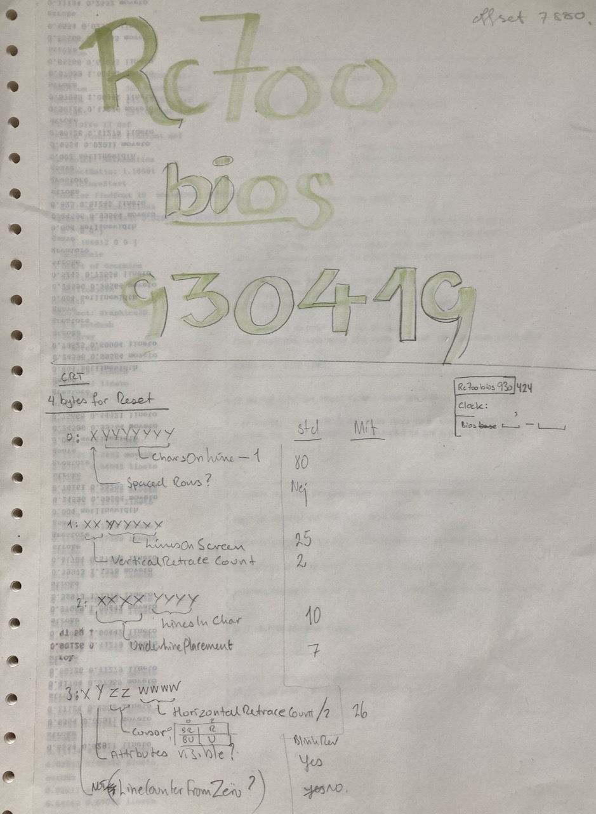

# RC700-bios

I reverse engineered the RC702 bios to get keyboard and serial
buffering (otherwise the 19.2k modem was too fast).

This is the various files I've found on the 8" floppies I still had
around in 2021. It turned out that since I printed out the listing on
1993-04-19 I added LaTeX, Disk and ISO-8859-1 keyboard support
labelled 1993-07-25 (most likely for QTERM modem communications to
IMADA).

To get the utilities on MacOS, run

    curl -o - http://www.retroarchive.org/cpm/lang/MASM-80.ZIP 
    unzip MASM-80.ZIP '*.COM'

Documentation:

* m80 - http://www.retroarchive.org/cpm/lang/MACRO-80.PDF
* l80 - http://www.retroarchive.org/cpm/lang/LINK-80.PDF

